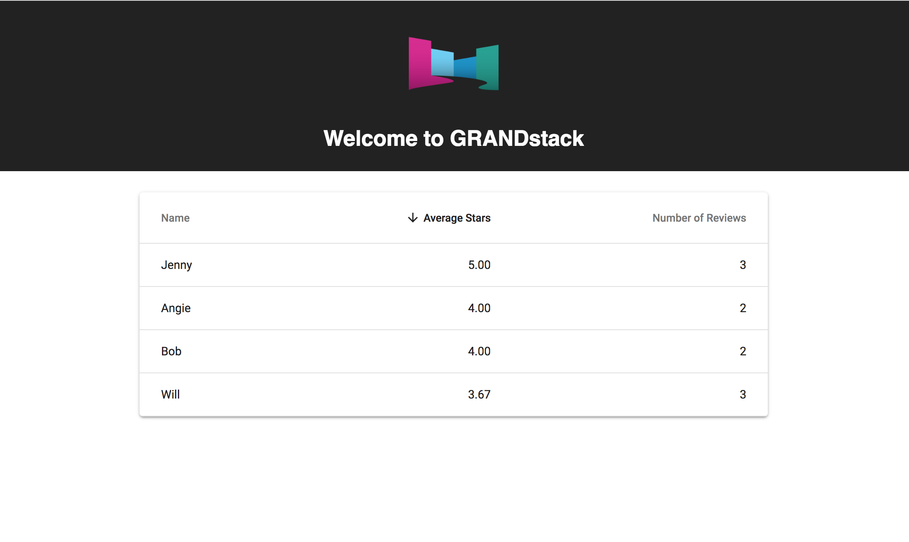

# BASF UI Coding Challenge - UI

This directory contains a React app (bootstrapped with Create React App) that uses Apollo Client to query a GraphQL API.

The template app queries for a list of chemical name types from the GraphQL API and displays them in a list.

## Quickstart

Install dependencies:

```
npm install
```

Start the development server:

```
npm start
```

This will serve the app on `http://localhost:3000`



## Configure

Configuration is done with environment variables specified in `.env`

Edit `.env` to specify the URI of the GraphQL API. The default is `http://localhost:4000`

*.env*

```
REACT_APP_GRAPHQL_URI=http://localhost:4000
```

## Material-UI

[Material-UI](https://material-ui.com/) components are included. See [the docs](https://material-ui.com/getting-started/usage/) for an overview of the components included. This code challenge makes use of the Material-UI components.

## Create React App


This project was bootstrapped with [Create React App](https://github.com/facebookincubator/create-react-app).

Below you will find some information on how to perform common tasks.<br>
You can find the most recent version of this guide [here](https://github.com/facebookincubator/create-react-app/blob/master/packages/react-scripts/template/README.md).


## Folder Structure

After creation, your project should look like this:

```
my-app/
  README.md
  node_modules/
  package.json
  public/
    index.html
    favicon.ico
  src/
    components/
    container/
    utils/
    App.css
    App.js
    App.test.js
    index.css
    index.js
    logo.svg
```

For the project to build, **these files must exist with exact filenames**:

* `public/index.html` is the page template;
* `src/index.js` is the JavaScript entry point.

You can delete or rename the other files.

You may create subdirectories inside `src`. For faster rebuilds, only files inside `src` are processed by Webpack.<br>
You need to **put any JS and CSS files inside `src`**, otherwise Webpack won’t see them.

Only files inside `public` can be used from `public/index.html`.<br>
Read instructions below for using assets from JavaScript and HTML.

You can, however, create more top-level directories.<br>
They will not be included in the production build so you can use them for things like documentation.

## Available Scripts

In the project directory, you can run:

### `npm start`

Runs the app in the development mode.<br>
Open [http://localhost:3000](http://localhost:3000) to view it in the browser.

The page will reload if you make edits.<br>
You will also see any lint errors in the console.

### `npm test`

Launches the test runner in the interactive watch mode.<br>
See the section about [running tests](#running-tests) for more information.

### `npm run build`

Builds the app for production to the `build` folder.<br>
It correctly bundles React in production mode and optimizes the build for the best performance.

The build is minified and the filenames include the hashes.<br>
Your app is ready to be deployed!

See the section about [deployment](#deployment) for more information.

### `npm run eject`

**Note: this is a one-way operation. Once you `eject`, you can’t go back!**

If you aren’t satisfied with the build tool and configuration choices, you can `eject` at any time. This command will remove the single build dependency from your project.

Instead, it will copy all the configuration files and the transitive dependencies (Webpack, Babel, ESLint, etc) right into your project so you have full control over them. All of the commands except `eject` will still work, but they will point to the copied scripts so you can tweak them. At this point you’re on your own.

You don’t have to ever use `eject`. The curated feature set is suitable for small and middle deployments, and you shouldn’t feel obligated to use this feature. However we understand that this tool wouldn’t be useful if you couldn’t customize it when you are ready for it.

## Supported Browsers

By default, the generated project uses the latest version of React.

You can refer [to the React documentation](https://reactjs.org/docs/react-dom.html#browser-support) for more information about supported browsers.

## Supported Language Features and Polyfills

This project supports a superset of the latest JavaScript standard.<br>
In addition to [ES6](https://github.com/lukehoban/es6features) syntax features, it also supports:

* [Exponentiation Operator](https://github.com/rwaldron/exponentiation-operator) (ES2016).
* [Async/await](https://github.com/tc39/ecmascript-asyncawait) (ES2017).
* [Object Rest/Spread Properties](https://github.com/sebmarkbage/ecmascript-rest-spread) (stage 3 proposal).
* [Dynamic import()](https://github.com/tc39/proposal-dynamic-import) (stage 3 proposal)
* [Class Fields and Static Properties](https://github.com/tc39/proposal-class-public-fields) (part of stage 3 proposal).
* [JSX](https://facebook.github.io/react/docs/introducing-jsx.html) and [Flow](https://flowtype.org/) syntax.

Learn more about [different proposal stages](https://babeljs.io/docs/plugins/#presets-stage-x-experimental-presets-).

While we recommend using experimental proposals with some caution, Facebook heavily uses these features in the product code, so we intend to provide [codemods](https://medium.com/@cpojer/effective-javascript-codemods-5a6686bb46fb) if any of these proposals change in the future.

Note that **the project only includes a few ES6 [polyfills](https://en.wikipedia.org/wiki/Polyfill)**:

* [`Object.assign()`](https://developer.mozilla.org/en/docs/Web/JavaScript/Reference/Global_Objects/Object/assign) via [`object-assign`](https://github.com/sindresorhus/object-assign).
* [`Promise`](https://developer.mozilla.org/en-US/docs/Web/JavaScript/Reference/Global_Objects/Promise) via [`promise`](https://github.com/then/promise).
* [`fetch()`](https://developer.mozilla.org/en/docs/Web/API/Fetch_API) via [`whatwg-fetch`](https://github.com/github/fetch).

If you use any other ES6+ features that need **runtime support** (such as `Array.from()` or `Symbol`), make sure you are including the appropriate polyfills manually, or that the browsers you are targeting already support them.

Also note that using some newer syntax features like `for...of` or `[...nonArrayValue]` causes Babel to emit code that depends on ES6 runtime features and might not work without a polyfill. When in doubt, use [Babel REPL](https://babeljs.io/repl/) to see what any specific syntax compiles down to.


## Formatting Code Automatically

Prettier is an opinionated code formatter with support for JavaScript, CSS and JSON. With Prettier you can format the code you write automatically to ensure a code style within your project. See the [Prettier's GitHub page](https://github.com/prettier/prettier) for more information, and look at this [page to see it in action](https://prettier.github.io/prettier/).

To format our code whenever we make a commit in git, we need to install the following dependencies:

```sh
npm install --save husky lint-staged prettier
```

Alternatively you may use `yarn`:

```sh
yarn add husky lint-staged prettier
```

* `husky` makes it easy to use githooks as if they are npm scripts.
* `lint-staged` allows us to run scripts on staged files in git. See this [blog post about lint-staged to learn more about it](https://medium.com/@okonetchnikov/make-linting-great-again-f3890e1ad6b8).
* `prettier` is the JavaScript formatter we will run before commits.

Now we can make sure every file is formatted correctly by adding a few lines to the `package.json` in the project root.

Add the following line to `scripts` section:

```diff
  "scripts": {
+   "precommit": "lint-staged",
    "start": "react-scripts start",
    "build": "react-scripts build",
```

Next we add a 'lint-staged' field to the `package.json`, for example:

```diff
  "dependencies": {
    // ...
  },
+ "lint-staged": {
+   "src/**/*.{js,jsx,json,css}": [
+     "prettier --single-quote --write",
+     "git add"
+   ]
+ },
  "scripts": {
```

Now, whenever you make a commit, Prettier will format the changed files automatically. You can also run `./node_modules/.bin/prettier --single-quote --write "src/**/*.{js,jsx,json,css}"` to format your entire project for the first time.

Next you might want to integrate Prettier in your favorite editor. Read the section on [Editor Integration](https://prettier.io/docs/en/editors.html) on the Prettier GitHub page.


## Installing a Dependency

The generated project includes React and ReactDOM as dependencies. It also includes a set of scripts used by Create React App as a development dependency. You may install other dependencies (for example, React Router) with `npm`:

```sh
npm install --save react-router
```

Alternatively you may use `yarn`:

```sh
yarn add react-router
```

This works for any library, not just `react-router`.

